# Architecture Diagrams

**Generated:** 12/22/2025, 11:33:52 AM  
**Repository:** Rarsus/verabot  
**Branch:** feature/comprehensive-documentation-audit-and-modernization

---

## Architecture Overview

✅ **Handlers:** 23 total  
✅ **Services:** 5 total  
✅ **Middleware:** 4 components  

---

## System Architecture Overview

The following diagram shows the complete system architecture with all layers and their interactions:

```mermaid
graph TB
    subgraph Discord["🤖 Discord Bot Framework"]
        direction TB
        Bot["Discord.js Bot"]
    end

    subgraph Commands["📝 Command Layer"]
        direction TB
        Slash["Slash Commands"]
        Prefix["Prefix Commands"]
    end

    subgraph Handlers["🎯 Handler Layer"]
        direction TB
        H1["Admin Handlers<br/>(7)"]
        H2["Core Handlers<br/>(5)"]
        H3["Messaging Handlers<br/>(3)"]
        H4["Operations Handlers<br/>(3)"]
        H5["Quote Handlers<br/>(5)"]
    end

    subgraph Services["🔧 Service Layer"]
        direction TB
        S1["Database Service"]
        S2["Quote Service"]
        S3["User Service"]
        S4["Analytics Service"]
        S5["Cache Service"]
    end

    subgraph Middleware["🔐 Middleware Pipeline"]
        direction TB
        M1["Authentication"]
        M2["Rate Limiting"]
        M3["Logging"]
        M4["Error Handling"]
    end

    subgraph Data["💾 Data Layer"]
        direction TB
        DB["SQLite Database"]
    end

    Discord --> Commands
    Commands --> Handlers
    Handlers --> Services
    Services --> Data
    Handlers --> Middleware
    Middleware --> Services

    style Discord fill:#e1f5ff
    style Commands fill:#f3e5f5
    style Handlers fill:#fff3e0
    style Services fill:#f1f8e9
    style Middleware fill:#fce4ec
    style Data fill:#ede7f6
```



### Architecture Layers

1. **Discord Bot Framework** - Discord.js integration and core bot functionality
2. **Command Layer** - Slash commands and prefix commands
3. **Handler Layer** - Event and command handlers organized by category
4. **Service Layer** - Business logic and data operations
5. **Middleware Pipeline** - Cross-cutting concerns (auth, logging, error handling)
6. **Data Layer** - SQLite database persistence

---

## Handler Organization

Handlers are organized into 5 categories based on their responsibilities:


### Handler Categories

#### Admin (7 handlers)

**Location:** `src/app/handlers/admin`

**Files:**
- `AllowChannelHandler.js`
- `AllowedHandler.js`
- `AllowHandler.js`
- `AllowRoleHandler.js`
- `AllowUserHandler.js`
- `AuditHandler.js`
- `DenyHandler.js`

#### Core (5 handlers)

**Location:** `src/app/handlers/core`

**Files:**
- `HelpHandler.js`
- `InfoHandler.js`
- `PingHandler.js`
- `StatsHandler.js`
- `UptimeHandler.js`

#### Messaging (3 handlers)

**Location:** `src/app/handlers/messaging`

**Files:**
- `BroadcastHandler.js`
- `NotifyHandler.js`
- `SayHandler.js`

#### Operations (3 handlers)

**Location:** `src/app/handlers/operations`

**Files:**
- `DeployHandler.js`
- `HeavyWorkHandler.js`
- `JobStatusHandler.js`

#### Quotes (5 handlers)

**Location:** `src/app/handlers/quotes`

**Files:**
- `AddQuoteHandler.js`
- `ListQuotesHandler.js`
- `QuoteHandler.js`
- `RandomQuoteHandler.js`
- `SearchQuotesHandler.js`

---

## Service Dependencies

Services provide business logic and data operations. The following diagram shows service relationships:


### Services (5)

- **CommandService** - `src/core/services/CommandService.js`
- **HelpService** - `src/core/services/HelpService.js`
- **PermissionService** - `src/core/services/PermissionService.js`
- **QuoteService** - `src/core/services/QuoteService.js`
- **RateLimitService** - `src/core/services/RateLimitService.js`

---

## Middleware Pipeline

Middleware components process requests and responses in the following pipeline:


### Middleware Components (4)

- **AuditMiddleware** - `src/app/middleware/AuditMiddleware.js`
- **LoggingMiddleware** - `src/app/middleware/LoggingMiddleware.js`
- **PermissionMiddleware** - `src/app/middleware/PermissionMiddleware.js`
- **RateLimitMiddleware** - `src/app/middleware/RateLimitMiddleware.js`

---

## Component Summary

| Component Type | Count | Percentage |
|---|---|---|
| Handlers | 23 | 72% |
| Services | 5 | 16% |
| Middleware | 4 | 13% |
| **TOTAL** | **32** | **100%** |

---

## Data Structures

### Handler Structure
```json
{
  "category": {
    "path": "src/app/handlers/{category}",
    "count": 8,
    "files": ["file1", "file2", ...]
  }
}
```

### Service Structure
```json
{
  "services": ["service1", "service2", ...]
}
```

### Middleware Structure
```json
{
  "middleware": ["middleware1", "middleware2", ...]
}
```

---

## Design Patterns Used

### Handler Pattern
- Organized by responsibility (admin, core, messaging, operations, quotes)
- Each handler encapsulates related functionality
- Clear separation of concerns

### Service Pattern
- Centralized business logic
- Reusable across handlers
- Dependency injection ready

### Middleware Pattern
- Pipeline-based processing
- Request/response modification
- Cross-cutting concerns

---

## Integration Points

- **Discord.js** - Bot framework and Discord API integration
- **Database Service** - SQLite persistence layer
- **Event Bus** - Internal message passing
- **Configuration** - Environment and settings management

---

## Guidelines

When adding new components:

1. **New Handler** - Add to appropriate category subdirectory in `src/app/handlers/`
2. **New Service** - Add to `src/core/services/` and register in service container
3. **New Middleware** - Add to `src/app/middleware/` and register in pipeline

This document is auto-generated. See `scripts/docs/generate-architecture-diagrams.js` for details.

---

**Last Updated:** 2025-12-22T10:33:52.688Z  
**Version:** 1.0.0
